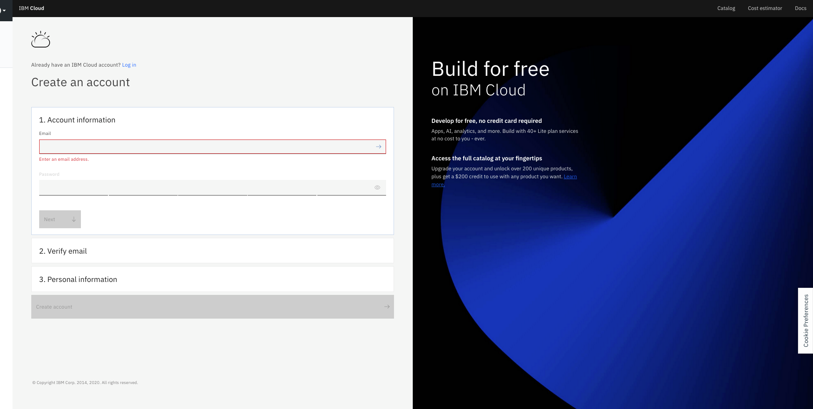
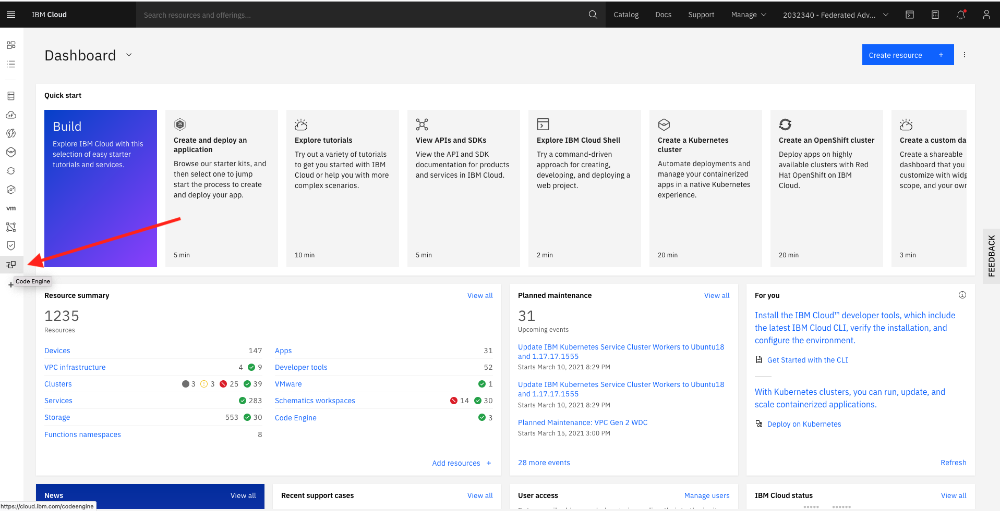
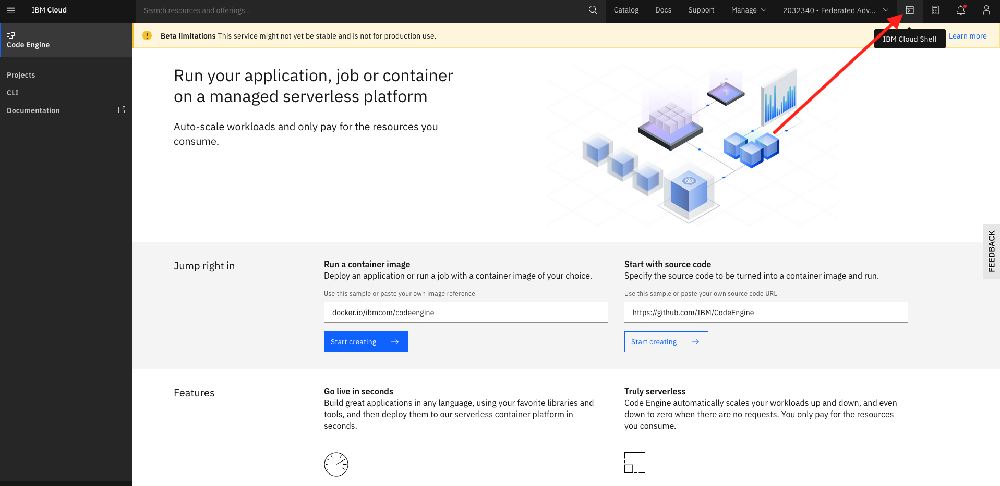

# Register to IBM Cloud 

[Register IBM Cloud](https://ibm.biz/Bdfxxf )

Please make sure to run all steps to get a valid IBM Lite Cloud account 

<!---   # Go to the Labs ---> 
<!---  First run the setup steps then go to Exercise 1 ---> 
<!---  [access to IBM OpenLabs for Code Engine]( https://developer.ibm.com/openlabs/fs2021-codeengine) --->

# Login to IBMCLOUD 
 
1. From the IBM Cloud dashboard choose Code Engine from the left side bar 

this is the Code Engine User Interface , you will be able to deploy apps from here, but we will start first deploying applications using the CE CLI.
2. Click on the  IBM Cloud Shell (at the right side of the screen), IBM CLoud Shell has all the needed CLI's installed .

3. Log in to the IBM Cloud CLI: `ibmcloud login -a cloud.ibm.com -r us-south`
4. Enter your IBM Cloud credentials when prompted.
  **Note:** If you have a federated ID, use `ibmcloud login --sso` to log in to the IBM Cloud CLI. Enter your user name, and use the provided URL in your CLI output to retrieve your one-time passcode. You know you have a federated ID when the login fails without the `--sso` and succeeds with the `--sso` option.
  
3. Select an account Enter a number : `your account probably 1  `  ( **not** the DTE account )   
4. Target a resource group by running the following command `iibmcloud target -g default`
5. Go to https://cloud.ibm.com/docs/codeengine?topic=codeengine-deploy-app-tutorial and start with" **Tutorial: Deploying applications** and then you may run all the other tutorials.

# IBM Code Engine samples 
https://github.com/IBM/CodeEngine

# IBM Cloud Code Engine in the cloud catalog 
https://cloud.ibm.com/codeengine/overview

# Documentation 
https://cloud.ibm.com/docs/codeengine

