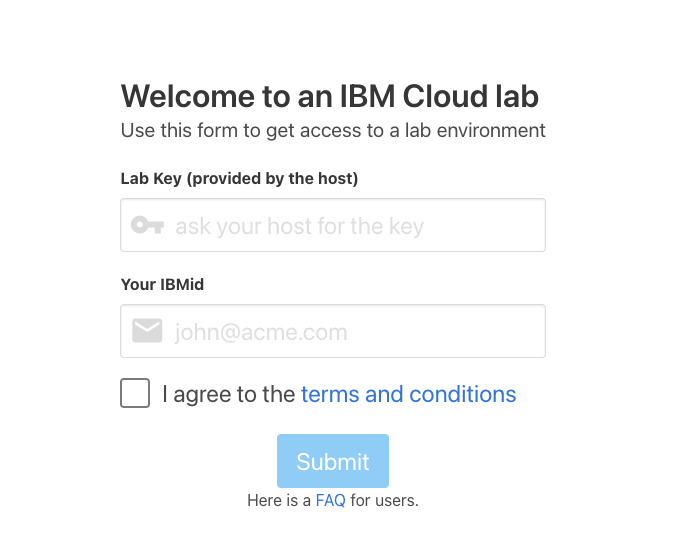
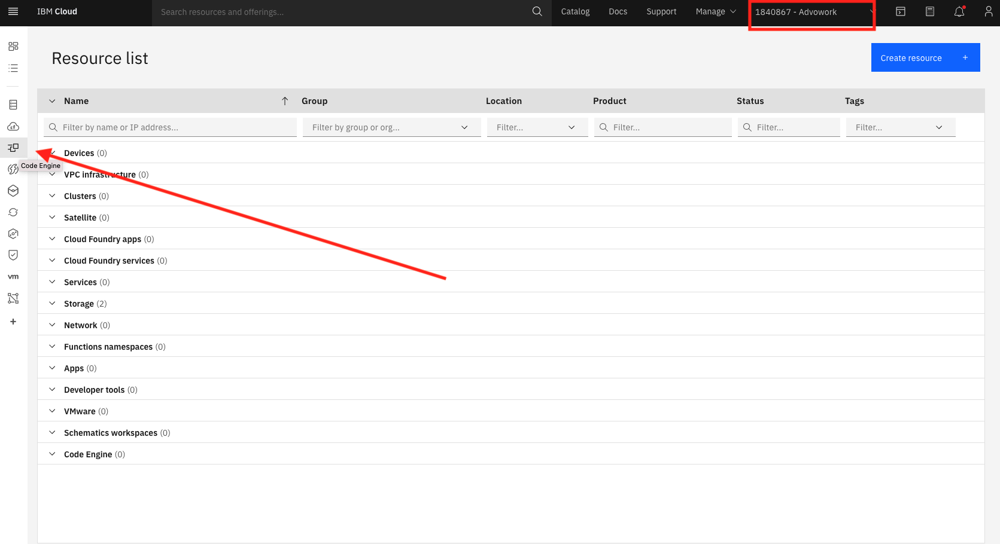

# Register to IBM Cloud 

[Register IBM Cloud](https://ibm.biz/Bdfv9E )

Please make sure to run all steps to get a valid IBM Lite Cloud account 

<!---   # Go to the Labs ---> 
<!---  First run the setup steps then go to Exercise 1 ---> 
<!---  [access to IBM OpenLabs for Code Engine]( https://developer.ibm.com/openlabs/fs2021-codeengine) --->
# Request to be authorized to create Code Engine projects under the IBM Lab Account  
1. [Please go to:](https://code-engine-workshop.mybluemix.net) with the password of `cerocks`
 

2. You will soon get an email with an invite , please follow the instructions.

<!---- --->

You will be able to use this option  to use Code Engine only for a short period of time. Please note that we will delete  any project that is older then 24-72 hours, so this is designed for short term learning.

# Go to Code Engine and start working 
 
1. From the IBM Cloud dashboard choose Code Engine from the left side bar , please make sure that you using the IBM Lab Account --> 1840867- Advowork 

this is the Code Engine User Interface , you will be able to deploy apps from here, but we will start first deploying applications using the CE CLI.
2. Click on the  IBM Cloud Shell (at the right side of the screen), IBM CLoud Shell has all the needed CLI's installed .

3. Log in to the IBM Cloud CLI: `ibmcloud login -a cloud.ibm.com -r us-south`
4. Enter your IBM Cloud credentials when prompted.
  **Note:** If you have a federated ID, use `ibmcloud login --sso` to log in to the IBM Cloud CLI. Enter your user name, and use the provided URL in your CLI output to retrieve your one-time passcode. You know you have a federated ID when the login fails without the `--sso` and succeeds with the `--sso` option.
  
3. Select an account Enter a number : `2. Advowork (e2b54d0c3bbe4180b1ee63a0e2a7aba4) <-> 1840867  `  ( **not** not you  account )   
4. Target a resource group by running the following command `ibmcloud target -g advowork`
5. Create a project `ibmcloud ce project create --name xxxxxx` (**where xxxxxx*** is a uniqe name like your account name , use only small letters, this is due to the fact that we all share the same account for this lab)  
6. Go to https://cloud.ibm.com/docs/codeengine?topic=codeengine-deploy-app-tutorial and start with" **Tutorial: Deploying applications step 1** and then you may run all the other tutorials.

# IBM Code Engine samples 
https://github.com/IBM/CodeEngine

# IBM Cloud Code Engine in the cloud catalog 
https://cloud.ibm.com/codeengine/overview

# Documentation 
https://cloud.ibm.com/docs/codeengine

